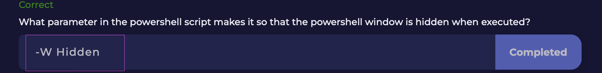
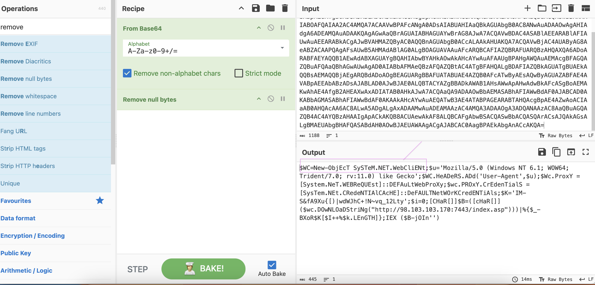

# PowerShell-Script-Challenge

I completed a PowerShell script challenge on LetsDefend!
Here are some key takeaways from this insightful experience:

✅ Analyzed a malicious PowerShell script and learned about code obfuscation techniques.

✅ Used the CyberChef tool to decode a Base64-encoded script.

✅ Discovered how PowerShell can run in hidden mode with the -W Hidden parameter to avoid detection.

✅ Learned about the -NonI parameter to prevent user interaction.

✅ Identified how the script communicates with external websites and disguises itself by spoofing the User-Agent string.

✅ Observed the use of proxy credentials to authenticate and bypass network restrictions.

✅ Identified the malicious URL the script connects to.

## Question 1

## Question 1 Parameter

## Question 2

## Question 2 Parameter

## Question 3

## Question 3 Parameter

## CyberChef Decoded Script

## CyberChef Decoded Script — Null Bytes Removed

## Question 4

## Website Interaction — CyberChef

## Question 5

## User-Agent : CyberChef

## Question 6

## Proxy — CyberChef

## Question 7

## URL — CyberChef

